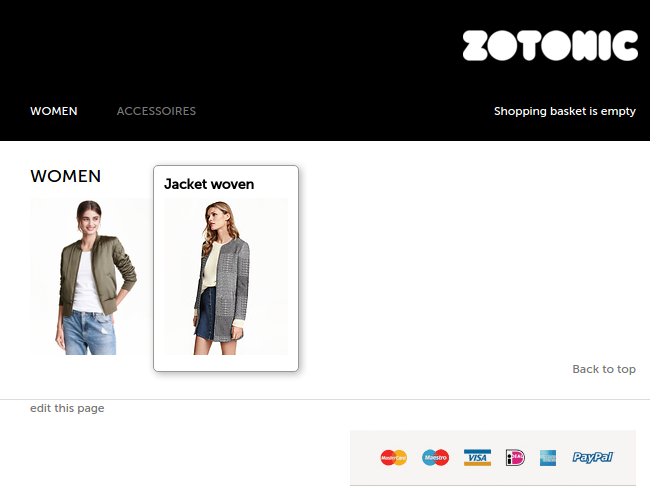

# mod_shop

A webshop module for [Zotonic](http://www.zotonic.com).

## Installation

 * Add `mod_shop` to your website. This installs a set of base
   templates which together form a webshop. A category tree will be
   created, with "product" as the root category. All products that are
   sold in the webshop should be part of this category tree.

  * Edit the main menu of the site, adding categories to the menu (e.g. "women's" and "accessoires").

  * In the admin, create one or more products, e.g. a bracelet in the
    "accessoires" category. Add a variant for each product (using the
    page connections on the edit page). For each variant, set the
    size, price and color code.

 * The product should now be visible on the frontend of the shop.

## Screenshot

## License

(c)2011-2016 Arjan Scherpenisse, see LICENSE for details

